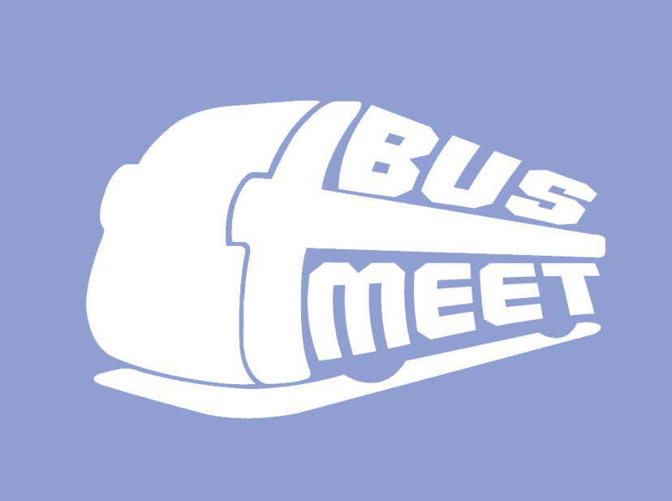

# BusMeet
## Check for buses! Meet your friends!

<!-- PROJECT LOGO -->
 

  

  <h3 align="center">BusMeet</h3>

  

    A project with the aim to let people meet up and check for buses at the same time!
     
    <a href="https://github.com/lisllin99/IEM-DIP-G4/tree/busmeet_v1/reports">
    <strong>Final Submission »</strong></a>
     
     
    <a href="https://github.com/lisllin99/IEM-DIP-G4/tree/busmeet_v1/reports/group report">Final Report</a>
    ·
    <a href="https://github.com/lisllin99/IEM-DIP-G4/tree/busmeet_v1/reports/video">Video</a>
    ·
     

   
    <a href="https://github.com/lisllin99/IEM-DIP-G4/tree/busmeet_v1/reports/poster">View Poster</a>
    ·
    <a href="https://github.com/lisllin99/IEM-DIP-G4/tree/busmeet_v1/reports/presentation slides">Presentation Slides</a>
    ·
    <a href="https://github.com/lisllin99/IEM-DIP-G4/tree/busmeet_v1/reports/user guide/How-To Guide.pdf">User Guide</a>
     
    
   
    <a href="https://github.com/lisllin99/IEM-DIP-G4/tree/busmeet_v1/reports/use case diagram/Use Case.pdf">Use Case Diagram</a>
    ·
    <a href="https://github.com/lisllin99/IEM-DIP-G4/tree/busmeet_v1/reports/flow diagram">Flow Diagram</a>
    .
      
    
   
    <a href="https://www.figma.com/file/burrFTjgfZm4VKm99SDVvF/BusLeh-APP?node-id=85%3A2">Figma Planner</a>
    ·
    <a href= "https://www.figma.com/file/XXGu0V3CkSMpCFTwyoHAwD/BusLeh-App-2.0?node-id=0%3A1">Initial Figma Planner</a>
        
    
    
  

## About BusMeet
Busmeet is a mobile project done by Information Engineering and Media (IEM) students for their
Design and Innovation Project module at Nanyang Technological University (NTU). We wanted to create an integrated application where users can check bus information while interacting with other users, such as messaging, location sharing, and sharing their estimated time of arrival (ETA).

## Technological Stack
[React Native](https://reactnative.dev/) was used on the front end. [AWS Amplify](https://aws.amazon.com/amplify/) was also use for us to set up a serverless architecture, along with services such as [AppSync](https://aws.amazon.com/appsync/), [DynamoDB](https://aws.amazon.com/dynamodb/) and [AWS Lambda](https://aws.amazon.com/lambda/). [Figma](https://www.figma.com/) was also used for prototyping and creating static designs.

## Get Started
To get started with the project:
1. Set up [Expo](https://expo.dev/)
2. Clone this project to your working directory
3. Run `npm install` in your work path
4. Run `expo start` and open the app using either the [Expo Go](https://expo.dev/client) app or an emulator
